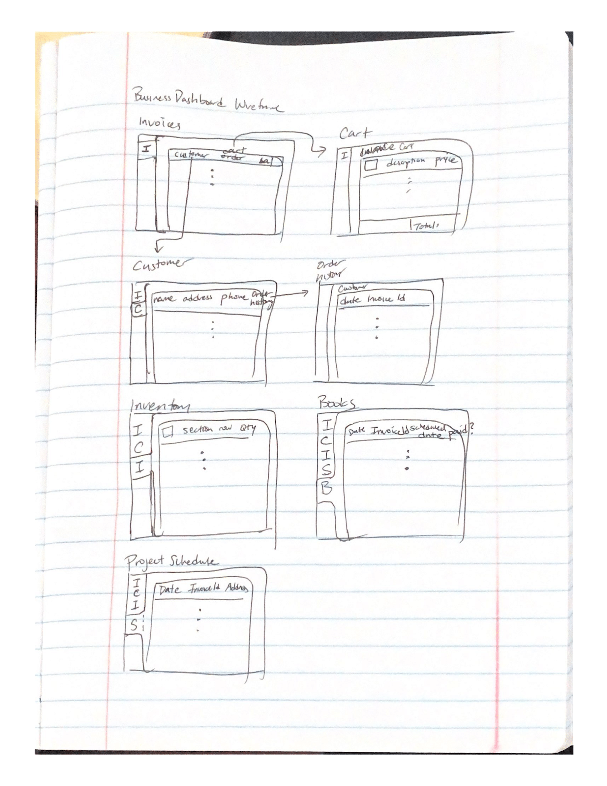

# Business Operations Dashboard
Biz Dashboard is designed for business owners to handle all their business processes including order fulfillment, inventory management, project scheduling, and more through a intuitive, clean and simple to use interface. 

# Goals:
Engineer using microservices architecture and implement the most essential business processes. 

# Built using
Frontend:

Backend:

Libraries:

## Services
- inventory
- books
- orders
- customers
- schedule projects

## Data Model

```javascript
Inventory Data Model
Item
{
  name: str, 
  size: str,  // ex. 2" x 4"
  color: str,    
  section: str, // ex. A
  row: int, // ex. 1
  img: url,    // a url of the image
}
Order Data Model
Invoice
{
  customerId: id,
  cart: Items[] // an array of items
  total: float // a total price
}
Customer
{
  id: id, // generate id
  name: str,
  phone: str,
  address: str,
  orderHistory: Invoices[] 
}
Container Data Models
Container
{
  containerId: id,
  containerName: str,
  shippingCompany: str,
  shipFrom: str,
  shipTo:  str,
  weight:  float,
  duty:  float, // price of duties
  arrivalDate: date
}
Bookkeeping Data Models
Accounts Receivables
{
  invoiceId: id,
  fulfilled: bool,
  datePaid: date
}

Project Schedule Data Models
{
  invoiceId: id,
  customerId: id,
  dataScheduled: date,
  address: customer.address,
  team: Team //future component
}

```
## Wireframes
/login - page for Staff/Manager login


/manager - page for manager 


/Data - analytics page for manager


## Site map


## User Stories or Use Cases
* As a manager, I can view upcoming projects, view my inventory, view open orders, view all invoices, view customers.
* As a staff I can view my assigned projects, items located in inventory, customer contact info.
 


## Research Topics
* ( 5 points) Create a data collection pipeline
* ( 2 points) Design a warehouse layout map
* ( 2 points) Secure logins // might not get to
* ( 1 points) Scalable database


## Annotations / References Used
1. 
2.


